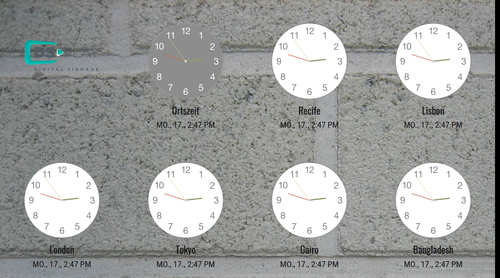
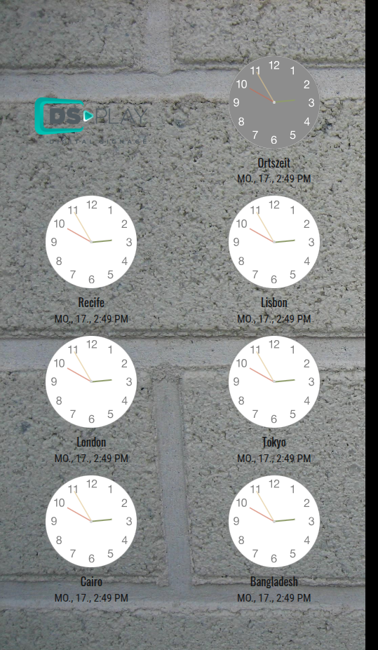
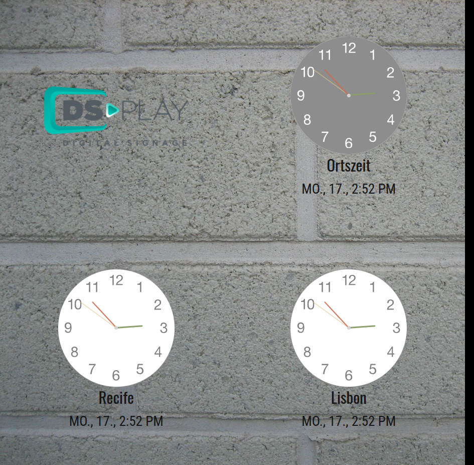
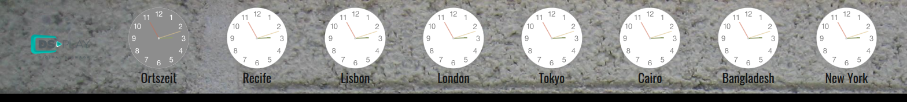
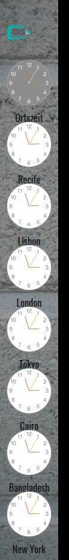

# DSPLAY - World Clocks (analog) Template

A [React](https://reactjs.org/) [HTML-based template](https://developers.dsplay.tv/docs/html-templates) for the [DSPLAY - Digital Signage](https://dsplay.tv/) platform — shows up to 8 analog clocks side by side, each for a configurable city/timezone.

> Built with [Vite](https://vitejs.dev/), requires Node.js 22.22.2+, 24.15.0+, or 26+ (see `.nvmrc`).

## Supported screen formats

| Landscape | Portrait | Square |
|-----------|----------|--------|
|  |  |  |

| Horizontal banner | Vertical banner |
|--------------------|-------------------|
|  |  |

> The clock count shown adapts per format (`src/components/main/index.jsx`): square drops to 3 clocks (fewer, larger) to stay legible, while the banner formats show one extra clock and hide the date/time text line to fit the reduced height/width.

## Template variables

| Key                 | Type   | Description                                                                                     |
|----------------------|--------|-----------------------------------------------------------------------------------------------|
| `city_1` .. `city_8` | string | City to show a clock for. `Local` shows the viewer's own timezone; otherwise one of: Amsterdam, Asuncion, Berlin, Bogota, Buenos Aires, Cairo, Cape Verde, Chicago, Dubai, Dublin, Hong Kong, Johannesburg, Lima, Lisbon, London, Luxembourg, Madrid, Moscow, New York, Paris, Recife, Rome, São Paulo, Tokyo, Zurich. Leave a slot blank to show fewer than 8 clocks. `city_1` is required. |
| `theme`              | string | Color theme — `light` or `dark`. The code also supports a third value, `sky`, not yet registered in the CMS. |
| `brand`              | string | Optional logo image shown alongside the clocks. Reduces the max number of visible clocks from 8 to 7 (hidden entirely on square screens). |
| `background`         | string | Optional background image.                                                                      |

> Remember to also register these as Template Vars (same name and type) when configuring this template in the DSPLAY CMS.

## Local development

```sh
npm install
npm start
```

`public/dsplay-data.js` defines `dsplay_config`/`dsplay_media`/`dsplay_template` mock globals used only when the template isn't running inside the actual DSPLAY app. Edit it to try out different cities/themes — the DSPLAY Player App replaces it with real content at runtime.

## Packing (release build)

```sh
npm run zip
```

This builds the template with Vite, which also generates `template-variables.json` + `template-example-data.json` (via [@dsplay/template-manifest](https://www.npmjs.com/package/@dsplay/template-manifest)'s Vite plugin) — the DSPLAY CMS reads these two files to auto-detect this template's variables and seed default preview values. Note that `city_1..city_8` aren't detected by the scanner (they're read via a dynamically-constructed key, `` `city_${i + 1}` ``) — they're documented above instead. It then generates `template.zip`, ready to be deployed to the [DSPLAY Web Manager](https://manager.dsplay.tv/template/create).

## Test assets

To use test assets (images, videos, etc) during development, put them in the `public/test-assets` folder and reference them in `dsplay-data.js` using their relative path. `public/test-assets` is automatically excluded from the release build.

## Maintaining dependencies

Regular npm dependencies, not vendored files:

```sh
npm outdated
npm update
```

For a version outside the declared range (typically a major bump), apply it deliberately and verify `npm start`, `npm run build`, and `npm test` still work before committing.

### Commit conventions

See [AGENTS.md](AGENTS.md).

## More

To see more about DSPLAY HTML Templates, visit: https://developers.dsplay.tv/docs/html-templates
